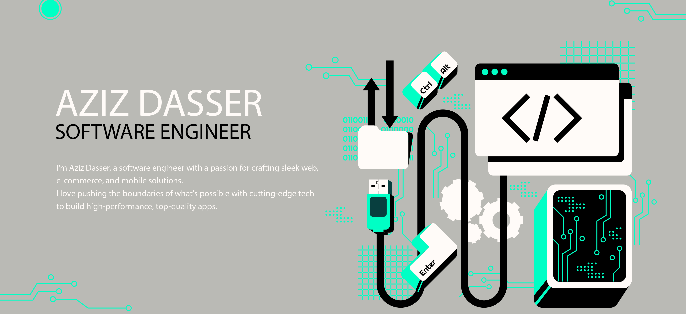

# Aziz Dasser - 💻 Software Engineer | Web & Mobile Dev Enthusiast | Tech Innovator 🚀

Hey there! 👋 I'm Aziz Dasser, a software engineer with a passion for crafting sleek web, e-commerce, and mobile solutions. I love pushing the boundaries of what's possible with cutting-edge tech to build high-performance, top-quality apps.

## 🛠️ Tech Stack

- **Languages:** Java, Python, PHP, JavaScript, Dart
- **Web Dev:** HTML, CSS, TypeScript, Angular, React, Laravel, Symfony
- **Databases:** Oracle, MySQL, MongoDB
  
## 🔥 Featured Projects

### [Code Sage Connect - VSCode Extension](https://github.com/aziz-dasser/code-sage-connect)
🚀 Built a VSCode extension to automate code reviews and generate unit tests—because who doesn’t love efficient coding?

### [E-commerce Website with Laravel](https://github.com/aziz-dasser/ecommerce-laravel)
🛒 Designed and developed a full-featured e-commerce site with order management, online payments, and delivery tracking.

### [Association Management App with Symfony](https://github.com/aziz-dasser/association-management)
👥 Created a web app for managing members, events, and all the activities that keep associations thriving.

## 🌟 Let's Connect!

📬 Let’s connect and create something amazing together!
🌍 Based in Rabat, Morocco | 🌐 Open to global opportunities

I’m always excited to collaborate on new projects or just chat about tech. Hit me up on LinkedIn!

